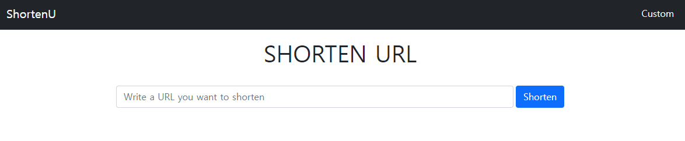
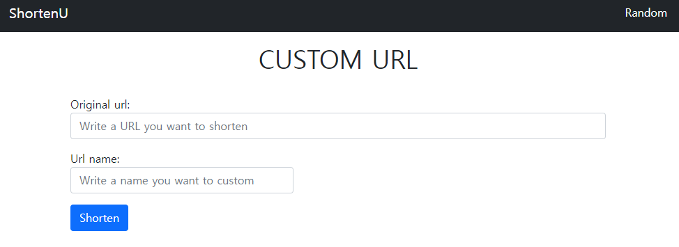
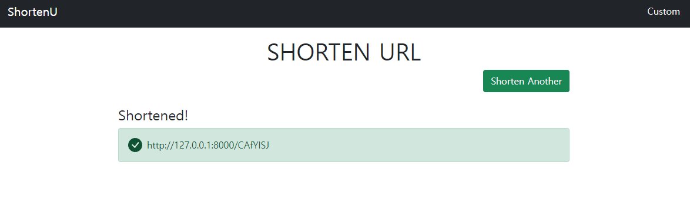

# URL Shortener Project

---

## 개요

- URL을 입력받아 짧은 URL을 반환
  - 서버 주소 + (알파벳 대소문자 + 숫자)로 이루어진 7자리 랜덤 문자열
- 사용자가 임의로 URL의 이름 지정 가능
- 단축된 URL은 중복되지 않아야 함
- 단축된 URL로 요청이 들어오면 원래 URL로 Redirect

---

## 기술 스택

- Django
- Bootstrap

*장고가 끝나서 DRF를 이용해 만들어보려고 했으나 아직 vue를 배우지 않아서  DRF는 이용하지 않았고 장고 템플릿(+부트스트랩)을 이용해 만들어보았다.*

*배포는 하지 않아서 로컬 호스트 주소에 실제로 동작하지 않는다.* 


## Model(Database)

```python
from django.db import models

# Create your models here.
class ShortUrl(models.Model):
    original_url = models.URLField()
    url_name = models.CharField(max_length=100, unique=True)

    def __str__(self):
        return self.url_name
```

| Field        | Type      |
| ------------ | --------- |
| original_url | URLField  |
| url_name     | CharField |

- url_name에는 단축된 URL 전체가 아닌 랜덤생성된 문자열과 커스터마이징 된 문자열 이름만 저장하기 위해 CharField로 지정했다. 또한 중복되면 안 되기 때문에 unique=True 속성을 주었다.
- form에서 url_name은 입력받지 않도록 해주었다.


## URL

```python
# project/urls.py
from django.contrib import admin
from django.urls import path, include
from shorts import views

urlpatterns = [
    path('admin/', admin.site.urls),
    path('shortenu/', include('shorts.urls')),
    path('<str:new_url>/', views.connect_to_original),
]

# shorts/urls.py
from django.urls import path
from . import views

urlpatterns = [
    path('', views.shortening, name='random'),
    path('custom/', views.custom_shortening, name='custom'),
]
```

- shortenu/로 요청이 들어오면 랜덤으로 URL을 반환해주는 페이지, shortenu/custom/으로 요청이 들어오면 URL을 커스터마이징 할 수 있는 페이지로 이어지도록 했다.
- redirect하는 URL은 짧아야 하므로 shortenu/를 붙이지 않고 서버 주소에 바로 문자열을 붙여 요청을 받도록 했다. view함수에서 단축 URL을 반환할 때도 서버 주소에 바로 문자열을 붙여 반환하도록 했다.


## view

```python
import string
import random
from django.shortcuts import render, redirect
from django.views.decorators.http import require_http_methods, require_safe
from .models import ShortUrl
from .forms import ShortUrlForm, CustomShortUrlForm

# Create your views here.
@require_http_methods(['GET', 'POST'])
def shortening(request):
    if request.method == 'POST':
        form = ShortUrlForm(request.POST)
        if form.is_valid():
            origin_url = form.save(commit=False)
            new_url = ''.join([random.choice(string.ascii_letters+string.digits) for _ in range(7)])
            while ShortUrl.objects.filter(url_name=new_url).exists():
                new_url = ''.join([random.choice(string.ascii_letters+string.digits) for _ in range(7)])
            origin_url.url_name = new_url
            origin_url.save()
            context = {
                'submited': 1,
                'new_url': 'http://127.0.0.1:8000/' + new_url,
            }
            return render(request, 'shorts/shorten.html', context)
    else:
        form = ShortUrlForm()
    context = {
        'submited': 0,
        'form': form,
    }
    return render(request, 'shorts/shorten.html', context)

@require_safe
def connect_to_original(request, new_url):
    urlname = ShortUrl.objects.get(url_name=new_url)
    origin_url = urlname.original_url
    print(origin_url)
    return redirect(origin_url)
```

- 랜덤 문자열을 만드는 부분
  - string 모듈을 import하면 `string.ascii_letters, string.digits`을 사용할 수 있는데 `string.ascii_letters`는 영어 대소문자를 포함하는 문자열,  `string.digits`는 0~9까지의 숫자열을 나타낸 문자열이다.
  - 랜덤한 요소를 하나 뽑아주는 random.choice를 통해 문자를 하나 뽑고 이를 7번 반복해 7자리 문자열을 만들었다.
  - exists()를 통해 해당 문자열이 이미 있는지 검사하고 중복되지 않을 때까지 새로 만든다.
- `submited`라는 변수를 따로 넘겨준 이유는 GET 메소드로 들어온 요청인지(단축 URL을 생성하기 위해 입력받기), POST 메소드로 들어온 요청인지(단축 URL 반환)에 따라 다른 결과를 보여주기 위해서이다. 사용자가 URL을 제출했으면(`submited == 1`) URL을 입력받는 창 없이 생성된 URL을 제공하고, 제출하지 않았으면 입력받는 창을 보여준다.
- 커스터마이징 페이지로 들어오는 요청도 위와 거의 비슷하게 작성됐는데, form의 유효성검사를 하기 때문에 같은 커스텀 URL이름을 제출하면 오류메세지와 함께 form이 제출되지 않는다.

*이제 장고 template과는 정말 이별일 것 같으므로 템플릿에 대해서는 따로 적지 않으려 한다. 간단히 말하자면 보여줄 페이지가 2개 뿐이라 따로 base.html을 만들지 않았고, 앱 이름도 지정하지 않았다. 하지만 중간에 url이름을 여러번 바꿀 수 있기 때문에 url name은 지정해줬다.*

---

## 결과 

- shortenu/ 페이지



- shortenu/costum/ 페이지



- URL 단축 요청을 했을 때(POST 요청) 결과 반환 페이지

